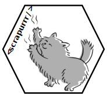
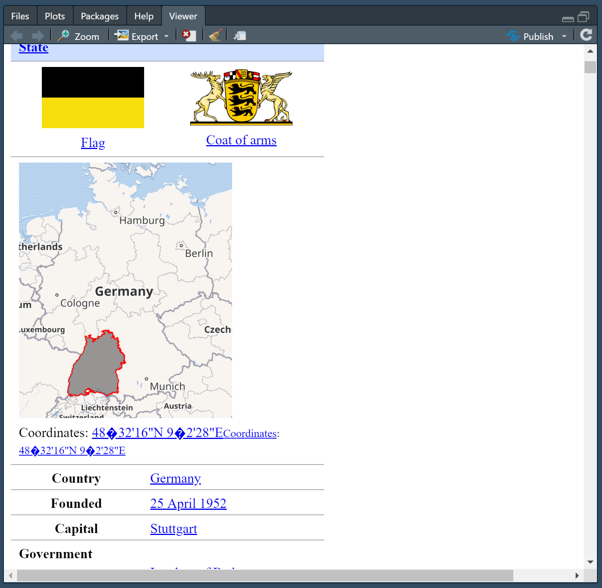

<!-- README.md is generated from README.Rmd. Please edit that file -->

```{r, include = FALSE}
knitr::opts_chunk$set(
  collapse = TRUE,
  comment = "#>",
  fig.path = "man/figures/README-"
)
```

# Webscraping in `R` with `scrapurrr` 

<!-- badges: start -->
[](https://codecov.io/gh/m-g-h/scrapurrr?branch=master)
[](https://github.com/m-g-h/scrapurrr/actions)
<!-- badges: end -->

### Overview
This package offers a functional programming style framework for webscraping and useful tools and tutorials to overcome common webscraping challenges. Check out the vignettes for webscraping workflows and infos on how to write the webscraping logic for specific webscraping challenges

Install the development version via
```{r eval=FALSE}
remotes::install_github("https://github.com/m-g-h/scrapurrr",
                        build_vignettes = T)
```


### Solve common webscraping tasks in a `scrapefun()`


Write a taylor-made `scrapefun()` that solves the challenges of your specific webscraping task:

  - Check if you need a webdriver or not using `view_html()`
  - Use `rvest` or implement a webdriver like like `phantomjs` or `Selenium` to download the webpage content
  - Use `rvest` for extracting information. The helpers `node_which()` and `html_find()` add `regex` selection
  - Use a VPN to rotate proxies (currently NordVPN via `NordVPN_quick_connect()`)
  - Use `V8` to execute `javascript`, e.g. to de-obfusciate emails.
  - Return output via `return_named_list()` conveniently as named list
  
### Automate repetitive scraping tasks


Step 1: define the list of `url`s or `html` files you want to scrape

Step 2: define a flexible `scrapefun()` taylor-made to the specific `scrapurrr` challenge at hand

Step 3: use `map_scrape()` to webscrape the entire list.

## Example Workflow

Generate list of links to scrape. In this example we scrape the Wikipedia pages of all German federal states:

```{r}
library(scrapurrr)
library(rvest)

state_links = read_html("https://en.wikipedia.org/wiki/States_of_Germany") %>% 
  html_element(".wikitable") %>% 
  html_elements("tr> td:nth-child(3)") %>% 
  html_elements("a") %>% 
  html_attr("href") %>% 
  paste0("https://en.wikipedia.org", .)

head(state_links)
```

Before defining the `scrapefun()` I assess whether I need a webdriver or not. With `view_html()` I can see what my computer receives with `read_html()` from `rvest`/`xml2` in the viewer:


Looks like we have a static html page and the capital is easily accessible. If the content would be loaded dynamically or if it was obfuscated I would have needed a webdriver like `phantomjs` or `Selenium`.

Now we define a scraping function that extracts the state capital from each page. I use `rvest` and `tidyverse` to power the function.
```{r message=FALSE, warning=FALSE}
library(tidyverse)

get_state_capital = function(link){
  # Download html
  .page = read_html(link)
  
  # Extract name of country
  State = .page %>% 
    html_element("h1") %>% 
    html_text()
  
  # Extract capital city
  Capital = .page %>% 
    html_element("table.infobox") %>% 
    html_table(header = F) %>% 
    filter(str_detect(X1, "Capital")) %>% 
    pull("X2")
  
  # Return results as named list. Objects prefixed with a dot get ignored
  return_named_list()
}
```

And then we can use `map_scrape()` to execute the task:
```{r}

results = map_scrape(state_links,
                    .f = get_state_capital)

head(results)

```


