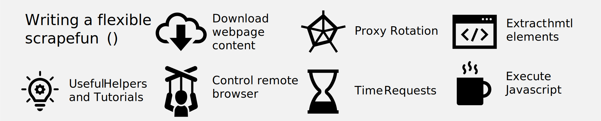
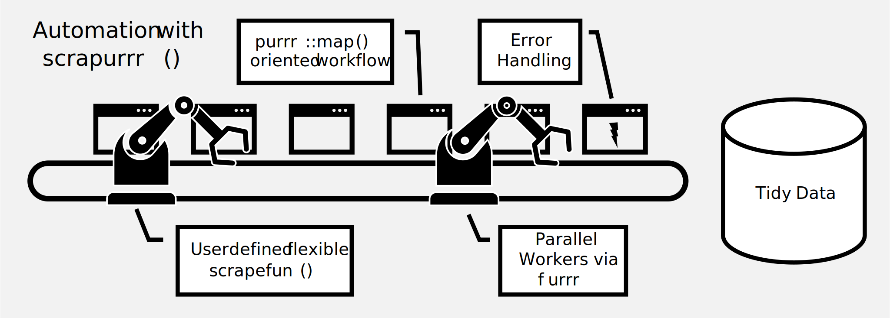
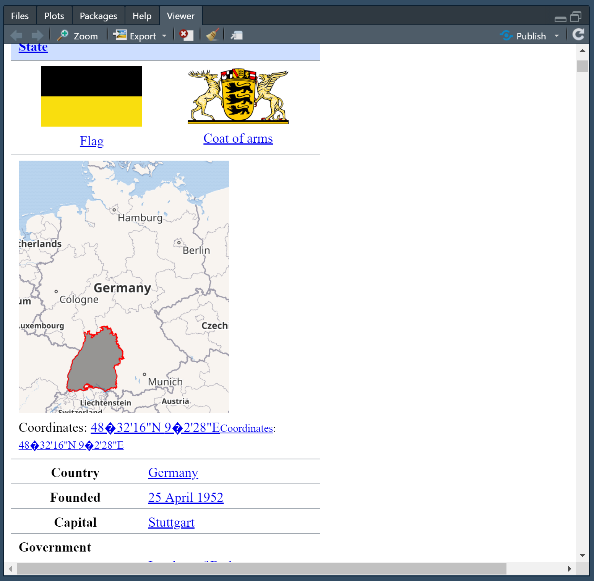

<!-- README.md is generated from README.Rmd. Please edit that file -->

# webscraping

<!-- badges: start -->
<!-- badges: end -->

This package offers a functional programming style framework for
webscraping and useful tools and tutorials to overcome common
webscraping challenges.

### Solve common webscraping tasks in a `scrapefun()`



Write a taylor-made `scrapefun()` that solves the challenges of your
specific webscraping task:

-   Check if you need a webdriver or not using `view_html()`
-   Use `rvest` or implement a webdriver like like `phantomjs` or
    `Selenium` to download the webpage content
-   Use `rvest` for extracting information. The helpers `node_which()`
    and `html_find()` add `regex` selection
-   Use a VPN to rotate proxies (currently NordVPN via
    `NordVPN_quick_connect()`)
-   Use `V8` to execute `javascript`, e.g. to de-obfusciate emails.
-   Return output via `return_named_list()` conveniently as named list

### Automate repetitive scraping tasks



Step 1: define the list of `url`s or `html` files you want to scrape

Step 2: define a flexible `scrapefun()` taylor-made to the specific
webscraping challenge at hand

Step 3: use `map_scrape()` to webscrape the entire list.

## Example Workflow

Generate list of links to scrape. In this example we scrape the
Wikipedia pages of all German federal states:

``` r
library(webscraping)
library(rvest)

state_links = read_html("https://en.wikipedia.org/wiki/States_of_Germany") %>% 
  html_element(".wikitable") %>% 
  html_elements("tr> td:nth-child(3)") %>% 
  html_elements("a") %>% 
  html_attr("href") %>% 
  paste0("https://en.wikipedia.org", .)

head(state_links)
#> [1] "https://en.wikipedia.org/wiki/Baden-W%C3%BCrttemberg"
#> [2] "https://en.wikipedia.org/wiki/Bavaria"               
#> [3] "https://en.wikipedia.org/wiki/Berlin"                
#> [4] "https://en.wikipedia.org/wiki/Brandenburg"           
#> [5] "https://en.wikipedia.org/wiki/Bremen_(state)"        
#> [6] "https://en.wikipedia.org/wiki/Hamburg"
```

Before defining the `scrapefun()` I assess whether I need a webdriver or
not. With `view_html()` I can see what my computer receives with
`read_html()` from `rvest`/`xml2` in the viewer:


Looks like we have a static html page and the capital is easily
accessible. If the content would be loaded dynamically or if it was
obfuscated I would have needed a webdriver like `phantomjs` or
`Selenium`.

Now we define a scraping function that extracts the state capital from
each page. I use `rvest` and `tidyverse` to power the function.

``` r
library(tidyverse)

get_state_capital = function(link){
  # Download html
  .page = read_html(link)
  
  # Extract name of country
  State = .page %>% 
    html_element("h1") %>% 
    html_text()
  
  # Extract capital city
  Capital = .page %>% 
    html_element("table.infobox") %>% 
    html_table(header = F) %>% 
    filter(str_detect(X1, "Capital")) %>% 
    pull("X2")
  
  # Return results as named list. Objects prefixed with a dot get ignored
  return_named_list()
}
```

And then we can use `map_scrape()` to execute the task:

``` r
results = map_scrape(state_links,
                    .f = get_state_capital)
#> 2021-09-25 18:34:51 1/16: https://en.wikipedia.org/wiki/Baden-W%C3%BCrttemberg
#> 2021-09-25 18:34:51 2/16: https://en.wikipedia.org/wiki/Bavaria
#> 2021-09-25 18:34:51 3/16: https://en.wikipedia.org/wiki/Berlin
#> 2021-09-25 18:34:51 4/16: https://en.wikipedia.org/wiki/Brandenburg
#> 2021-09-25 18:34:52 5/16: https://en.wikipedia.org/wiki/Bremen_(state)
#> 2021-09-25 18:34:52 6/16: https://en.wikipedia.org/wiki/Hamburg
#> 2021-09-25 18:34:52 7/16: https://en.wikipedia.org/wiki/Hesse
#> 2021-09-25 18:34:52 8/16: https://en.wikipedia.org/wiki/Lower_Saxony
#> 2021-09-25 18:34:52 9/16: https://en.wikipedia.org/wiki/Mecklenburg-Western_Pomera
#> 2021-09-25 18:34:53 10/16: https://en.wikipedia.org/wiki/North_Rhine-Westphalia
#> 2021-09-25 18:34:53 11/16: https://en.wikipedia.org/wiki/Rhineland-Palatinate
#> 2021-09-25 18:34:53 12/16: https://en.wikipedia.org/wiki/Saarland
#> 2021-09-25 18:34:53 13/16: https://en.wikipedia.org/wiki/Saxony
#> 2021-09-25 18:34:54 14/16: https://en.wikipedia.org/wiki/Saxony-Anhalt
#> 2021-09-25 18:34:54 15/16: https://en.wikipedia.org/wiki/Schleswig-Holstein
#> 2021-09-25 18:34:54 16/16: https://en.wikipedia.org/wiki/Thuringia
#> Finished

head(results)
#> # A tibble: 6 x 3
#>   Capital                              State                id
#>   <chr>                                <chr>             <int>
#> 1 Stuttgart                            Baden-Württemberg     1
#> 2 Munich                               Bavaria               2
#> 3 Capital city, state and municipality Berlin                3
#> 4 Potsdam                              Brandenburg           4
#> 5 Bremen                               Bremen (state)        5
#> 6 <NA>                                 Hamburg               6
```
