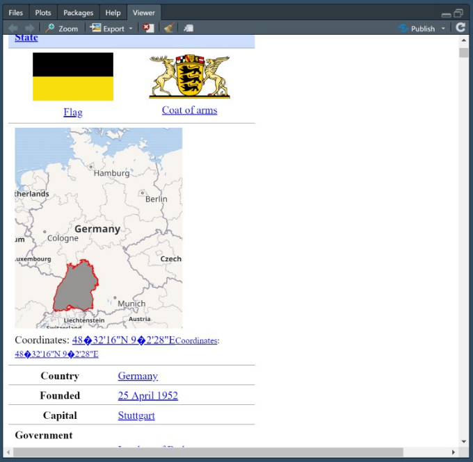

```{r, include = FALSE}
knitr::opts_chunk$set(
  collapse = TRUE,
  comment = "#>"
)
```

```{r setup}
library(scrapurrr)
```

This vignette explains the features you can put into a `scrapefun()` to solve your webscraping tasks:


## Useful Helper Functions

### Capturing `scrapefun()` output via `return_named_list()`

If you use `purrr::map_dfr()` and related mapping functions in `scrapurrr()`, your `scrapefun()` is supposed to return a named list. This allows to bind together multiple results row wise. Usually, this is implemented as:

```{r message=FALSE, warning=FALSE}

library(rvest)
library(tidyverse)

# Without `return_named_list()`
get_capitals = function(link){
  # Download html
  page = read_html(link)
  
  # Extract name of country
  State = page %>% 
    html_element("h1") %>% 
    html_text()
  
  # Extract capital city
  Capital = page %>% 
    html_element("table.infobox") %>% 
    html_table(header = F) %>% 
    filter(str_detect(X1, "Capital")) %>% 
    pull("X2")
  
  # Return results as named list
  list("State" = State,
       "Capital" = Capital)
}

get_capitals("https://en.wikipedia.org/wiki/Bavaria")

```

This can become tedious if there are many outputs. `return_named_list()` takes up and automates this tedious task. Just prefix all objects that should not be returned with a dot (e.g. `.page`):

```{r}

# With `return_named_list()`
get_capitals = function(link){
  # Download html
  .page = read_html(link)
  
  # Extract name of country
  State = .page %>% 
    html_element("h1") %>% 
    html_text()
  
  # Extract capital city
  Capital = .page %>% 
    html_element("table.infobox") %>% 
    html_table(header = F) %>% 
    filter(str_detect(X1, "Capital")) %>% 
    pull("X2")
  
  # Return results as named list
  return_named_list()
}

get_capitals("https://en.wikipedia.org/wiki/Bavaria")
```

### Extraction using Regex via `node_which()` and `html_find()`

In the extraction step of webscraping one usually selects `nodes` using `css` or `XPath`, e.g. using the `rvest` packages `html_elements()`. However, sometimes these selectors are not enough. Consider the following `html`:

```{html}
<table>
  <tr>
    <th>Company</th>
    <th>Contact</th>
    <th>Country</th>
  </tr>
  <tr>
    <td>Alfreds Futterkiste</td>
    <td>Maria Anders</td>
    <td>Germany</td>
  </tr>
  <tr>
    <td>Centro comercial Moctezuma</td>
    <td>Francisco Chang</td>
    <td>Mexico</td>
  </tr>
</table>
```

This table has the three columns "Company", "Contact" and "Country". Suppose we want to get the contact to "Alfreds Futterkiste". Simply selecting all `td` nodes and then matching positions might work:
```{r include=FALSE}

html = "<table>
  <tr>
    <th>Company</th>
    <th>Contact</th>
    <th>Country</th>
  </tr>
  <tr>
    <td>Alfreds Futterkiste</td>
    <td>Maria Anders</td>
    <td>Germany</td>
  </tr>
  <tr>
    <td>Centro comercial Moctezuma</td>
    <td>Francisco Chang</td>
    <td>Mexico</td>
  </tr>
</table>" %>% 
  xml2::read_html()

```

```{r}
# I parsed the html into the object `html` in the background
library(rvest)

# Manual selection works
html %>% 
  html_elements("td") %>% 
  .[2]

# CSS selection by child position works:
html %>% 
  html_elements("tr:nth-child(2) > td:nth_child(2)")
```

But what if you have multiple tables and the position of the information (i.e. the row number) changes from table to table? This can be solved by `regex` selection of the text as implemented by `node_which()` and `html_find()`:

```{r}
library(scrapurrr)
# Get the position of the "Contact" to "Alfreds Futterkiste"
html %>% 
  html_elements("td") %>% 
  node_which("Alfreds Futterkiste", inc = 1)

# Get the node of the "Contact" to "Alfreds Futterkiste"
html %>% 
  html_elements("td") %>% 
  html_find("Alfreds Futterkiste", inc = 1)

```
Note that we use `inc = 1` in order to not select the `td` that contains "Alfreds Futterkiste", but the node that comes afterwards. In the context of a table this corresponds to the next column.

### Display Downloaded `html` and Pre-Testing via `view_html()`

The convenience funtion `view_html()` allows to view what the computer sees. Either provide a link to a wepage or the `html` directly to see the content in the RStudio viewer:
```{r eval=FALSE}
view_html("https://en.wikipedia.org/wiki/Bavaria")
```


You can also open it in your standard browser using the button next to the "broom" and then use developer tools to get to your `css` or `XPath` selectors.

This is useful for **pretesting**, i.e. for checking what the computer gets (and what it doesn't get). By using `view_html()` you can quickly judge if you need a webdriver like `Selenium` or `PhantomJS` or if standard scraping methods, e.g. from, `rvest` are sufficient.

### Shuffle NordVPN Servers using `NordVPN_quick_connect()`

If you have NordVPN installed, you can invoke the `Quick Connect` command from R via `system('"Path\\to\\NordVPN.exe" -c')`. This is what `NordVPN_quick_connect()` does if you invoke it. It also checks if a connection was established by trying to `GET` www.google.com and automatically tries a new proxy after 20 seconds.
