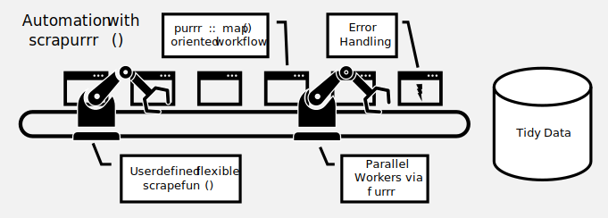

```{r, include = FALSE}
knitr::opts_chunk$set(
  collapse = TRUE,
  comment = "#>"
)
```

```{r setup}
library(scrapurrr)
```

This vignette explains webscraping workflows using the `map_scrape()` family of functions:


The basic `scrapurr` workflow is:

1. Define a `list` of links or html files to scrape
2. Write a `scrapefun()` that contains the webscraping logic
3. Apply the `scrapefun()` to the list using `scrapurrr()`

For more involved webscraping projects, we can split the on-line gathering of page contents from the off-line extraction and parsing (see below). This is useful when there are obstacles to content gathering and we can not trial-and-error indefenitly.

## Basic Workflow: Scraping German state capitals from Wikipedia

### Assessing the scope of the webscraping project
Lets start with scraping the capital city of Bavaria. This info is easily available, e.g. on [Wikipedia](https://en.wikipedia.org/wiki/Bavaria). 

Before writing the webscraper, lets assess whether we need a webdriver or not. With `view_html()` we can see what the computer receives via `read_html()` from `rvest`/`xml2` in the viewer:

Looks like we have a static html page and the capital is easily accessible. If the content would be loaded dynamically or if it was obfuscated I would have needed a webdriver like `phantomjs` or `Selenium`.

### Scraping a single Wikipedia page
Using `rvest` we can download the page `html` and extract the information:

```{r message=FALSE, warning=FALSE}

library(rvest)
library(tidyverse)

# Download the html of "https://en.wikipedia.org/wiki/Bavaria"
page = read_html("https://en.wikipedia.org/wiki/Bavaria")

# Extract name of country
page %>% 
  html_element("h1") %>% 
  html_text()

# Extract capital city
page %>% 
  html_element("table.infobox") %>% 
  html_table(header = F) %>% 
  filter(str_detect(X1, "Capital")) %>% 
  pull("X2")

```

### Scaling the webscraping task

To get the capitals of each of the 16 German states we need to access multiple Wikipedia pages. Let's use the basic `scrapurrr` style approach to this:

#### 1. Define the list of links from which data needs to be extracted

```{r}
# We could search the wikipedia links manually - or use webscraping:
state_links = read_html("https://en.wikipedia.org/wiki/States_of_Germany") %>% 
  html_element(".wikitable") %>% 
  html_elements("tr> td:nth-child(3)") %>% 
  html_elements("a") %>% 
  html_attr("href") %>% 
  paste0("https://en.wikipedia.org", .)

head(state_links)

```

#### 2. Define an **extraction function** capturing the repetitive webscraping tasks :

The following function captures the complete webscraping logic: downloading the page `html` and extracting the relevant content. For use in the `map_scrape_dfr()` function provided in this package one thing is important: that it returns a *named list*. This allows to present the output as a dataframe. 

```{r}
# Define the extraction function
get_capitals = function(link){
  # Download html
  .page = read_html(link)
  
  # Extract name of country
  State = .page %>% 
    html_element("h1") %>% 
    html_text()
  
  # Extract capital city
  Capital = .page %>% 
    html_element("table.infobox") %>% 
    html_table(header = F) %>% 
    filter(str_detect(X1, "Capital")) %>% 
    pull("X2")
  
  # Return results as named list
  return_named_list()
}

```
Further information on how to write a `scrapefun()` and how to use `return_named_list()` is given in `vignette("scrapefuns_and_helpers")`.

#### 3. Apply the function to each link in the list
For this purpose we use the `map_scrape_dfr()` function. It is basically a wrapper around `map_dfr()` from `purrr` that provides some webscraping-specific utilities. Let's use it for our search of capitals:
```{r message=TRUE, warning=TRUE}
library(scrapurrr)
# Map the function to all state links and merge the results by row into a dataframe
results = scrapurrr(state_links,
                    scrapefun = get_capitals,
                    map_fun = purrr::map_dfr)

# Print results
head(results)
```

## Splitted Workflow: On-Line Download, Off-Line Extraction (for more involved projects)
Sometimes it is necessary to separate the download of `html` from the extraction. This can be the case when there is a request limit on the desired page and one can not endlessly trial-and-error until the extraction function works, or when the page is rendered dynamically. A third reason is reproducibility and documentation of the raw `html`. In these cases it makes sense to first download all pages into `html` files on the harddrive and then extract them in a second step.

This processes can also be implemented using `map_scrape_dfr`:

### On-Line: Downloading the html

```{r}

# We reuse the list of wikipedia pages `state_list` from before
head(state_links)

# For this example we use a temporary folder to store the html files
tmp_folder = tempdir()

# Define the downloading function. We index each page with an id
download_html = function(link, id){
  
  # Define the filename
  file = file.path(tmp_folder,
                   id) %>% 
    paste0(., ".html")
  
  # Write the file to harddrive
  read_html(link) %>% 
    as.character() %>% 
    write_lines(file = file)
  
  # Return file path
  list("file" = file)
}

# Define id
id = 1:length(state_links)

# Scrape and save html
results = scrapurrr(state_links, id,
                    scrapefun = download_html,
                    map_fun = purrr::map2_dfr)

# The results in the dataframe
head(results)

# The files on the harddrive
head(list.files(tmp_folder,
                pattern = "html"))

```

### Off-Line: Extracting the Information
Now that we have the `html` as files on the hard drive, we have all the time in the world to experiment with our extraction function without the need to re-download the `html` each time.

We can actually use the exact same function as in the section above. The `link` argument now instead needs to lead to the `file` on the harddrive.

```{r}
# Define the extraction function
get_capitals = function(file){
  # Download html
  .page = read_html(file)
  
  # Extract name of country
  State = .page %>% 
    html_element("h1") %>% 
    html_text()
  
  # Extract capital city
  Capital = .page %>% 
    html_element("table.infobox") %>% 
    html_table(header = F) %>% 
    filter(str_detect(X1, "Capital")) %>% 
    pull("X2")
  
  # Return results as named list
  return_named_list()
}

# The files on the harddrive
state_files = list.files(tmp_folder,
                         full.names = T,
                         pattern = "html")

# Extraction
results = scrapurrr(state_links,
                    scrapefun = get_capitals,
                    map_fun = purrr::map_dfr)

# The results in the dataframe
head(results)

```

